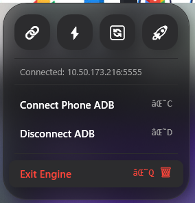

# DeX

## Features
- **Zero-Touch Connection:** Auto-connects when your PC joins your mobile hotspot.
- **Native Windows Share:** Right-click any file in Windows Explorer -> Share -> Send straight to your phone.
- **Pull Downloads:** One-click sync from your phone's `/sdcard/Download` straight to your PC.

## Previews

<!--  (Coming soon) -->

## Installation (Windows)

Because this app is not yet on the Microsoft Store, it uses a self-signed certificate. Windows will block the installation unless you trust the certificate first.

### Option 1: Auto-Updating Installer (Recommended)
1. Download `CodeDeX.cer` and install it to **Trusted Root Certification Authorities** (see Option 3 below for manual cert install, or run `Install-App.ps1` as Admin once to do it automatically).
2. Download and run `ConnectPhoneADB.appinstaller`. 
3. This will install the app and automatically check for updates in the background on future launches!

### Option 2: Scripted Install
1. Download the latest release (`ConnectPhoneADB.msix`, `CodeDeX.cer`, and `Install-App.ps1`).
2. Right-click `Install-App.ps1` and select **Run with PowerShell**.
3. Accept the Admin prompt. It will install the certificate and the app automatically.

### Option 3: The Manual Way
1. Download `ConnectPhoneADB.msix` and `CodeDeX.cer`.
2. Double-click `CodeDeX.cer`.
3. Click **Install Certificate...**
4. Select **Local Machine** -> Next.
5. Select **Place all certificates in the following store** -> Browse.
6. Select **Trusted Root Certification Authorities** -> OK -> Next -> Finish.
7. Double-click `ConnectPhoneADB.msix` to install the app.
